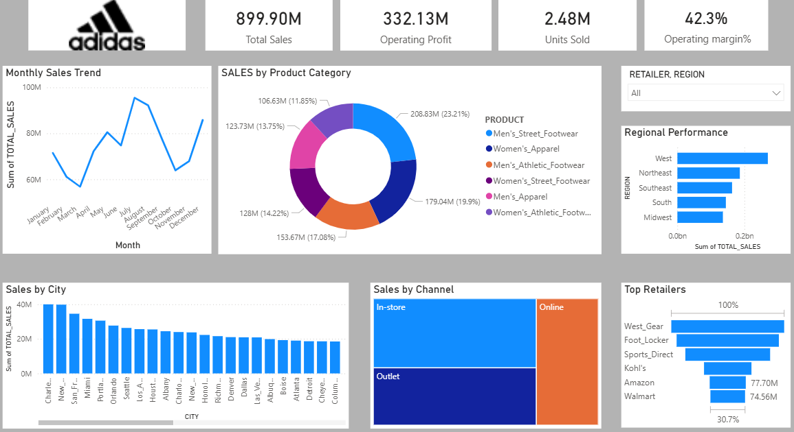

# Adidas Sales Performance Analysis (2020-2021)

## 📌 Project Overview
This project focuses on a comprehensive data analysis of Adidas sales performance during the years 2020 and 2021. The goal is to uncover key trends, regional performance, and the impact of various sales channels during this period.

## 📊 Key Insights
- **Sales Trends:** Analysis of month-over-month growth and seasonal patterns.
- **Regional Performance:** Identifying top-performing regions and cities.
- **Product Analysis:** Evaluating which product categories drove the highest revenue.
- **Channel Optimization:** Comparison between in-store sales and online retail performance.

## 🛠️ Tools & Technologies
- **Data Analysis & Visualization:** [Excel / Power BI / SQL]
- **Documentation:** Markdown

## 📂 Project Files
- `Adidas_Analysis_2020_2021`: The main project file containing data cleaning, calculations, and visual reports.
- `Data/`: Contains the datasets used for this analysis.

## 📈 Summary
The analysis highlights the resilience of digital sales channels and provides a data-driven look at how market dynamics shifted between 2020 and 2021. All visualizations and detailed findings are integrated within the project file.

---
*Developed as part of my Data Analytics portfolio.*
